# RT605 robot_virtual_system


## Introduction

This project is a simulation base on HIWIN RT605 robotic arm. To observe the mismatch of servo systems, we tuning the PID gain of servo motor to deduce the  scenareo.
The project include six motors with multi-loop PID control consist of position loop and velocity loop. The overall simulation run as the following steps:  

1.Initialize six joints with parameters base on Sanyo Denki CO.,LTD SANMOTION R2-Series.

2.Load pre-defined trajectory.  

3.start the simulation.

4.show the result include frequency response of each joint, cartesian trajectory(mm), joint trajectory(degree) and contouring error polar-plot(mm) the figures are optionally displayed.  

## Environments setup

This command tells Conda to create a new environment based on the specifications in the YAML file.  

- create rail_marking conda environment

```bash
conda env create -f requirement.yml
conda activate rt605_simulation_env
```

- activate conda environment

```bash
conda activate rt605_simulation_env
```


## Usage: arguments

usage: main.py [-h] [--path_dir PATH_DIR] [--GTorMode GTORMODE] [--FricTorMode FRICTORMODE] [-kpp1 KPP1] [-kpp2 KPP2] [-kpp3 KPP3] [-kpp4 KPP4] [-kpp5 KPP5] [-kpp6 KPP6] [-kpi1 KPI1] [-kpi2 KPI2] [-kpi3 KPI3] 
               [-kpi4 KPI4] [-kpi5 KPI5] [-kpi6 KPI6] [-kvp1 KVP1] [-kvp2 KVP2] [-kvp3 KVP3] [-kvp4 KVP4] [-kvp5 KVP5] [-kvp6 KVP6] [-kvi1 KVI1] [-kvi2 KVI2] [-kvi3 KVI3] [-kvi4 KVI4] [-kvi5 KVI5] [-kvi6 KVI6]
               [-pf] [-pc] [-pj] [-pp]

## RT605 simulation

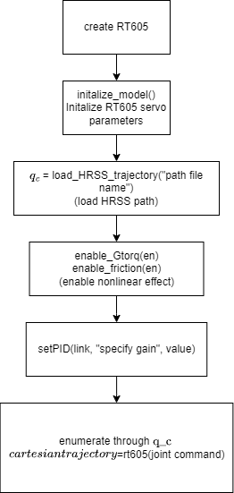

## Servo system

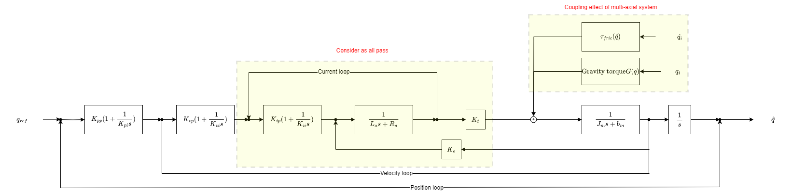

**optional arguments:**

<pre>
  -h, --help                  show this help message and exit  

  --path_dir PATH_DIR         reference trajectory file name  

  --GTorMode GTORMODE         set gravity torque on/off  

  --FricTorMode FRICTORMODE   set friction torque on/off

  -kpp1 KPP1, --Kpp1 KPP1     set joint 1 Kpp gain(ex: --Kpp1 100)  
  -kpp2 KPP2, --Kpp2 KPP2     set joint 2 Kpp gain  
  -kpp3 KPP3, --Kpp3 KPP3     set joint 3 Kpp gain  
  -kpp4 KPP4, --Kpp4 KPP4     set joint 4 Kpp gain  
  -kpp5 KPP5, --Kpp5 KPP5     set joint 5 Kpp gain
  -kpp6 KPP6, --Kpp6 KPP6     set joint 6 Kpp gain  

  -kpi1 KPI1, --Kpi1 KPI1     set joint 1 Kpi gain  
  -kpi2 KPI2, --Kpi2 KPI2     set joint 2 Kpi gain  
  -kpi3 KPI3, --Kpi3 KPI3     set joint 3 Kpi gain  
  -kpi4 KPI4, --Kpi4 KPI4     set joint 4 Kpi gain  
  -kpi5 KPI5, --Kpi5 KPI5     set joint 5 Kpi gain  
  -kpi6 KPI6, --Kpi6 KPI6     set joint 6 Kpi gain  

  -kvp1 KVP1, --Kvp1 KVP1     set joint 1 Kvp gain(ex: --Kvp1 100)  
  -kvp2 KVP2, --Kvp2 KVP2     set joint 2 Kvp gain  
  -kvp3 KVP3, --Kvp3 KVP3     set joint 3 Kvp gain  
  -kvp4 KVP4, --Kvp4 KVP4     set joint 4 Kvp gain  
  -kvp5 KVP5, --Kvp5 KVP5     set joint 5 Kvp gain  
  -kvp6 KVP6, --Kvp6 KVP6     set joint 6 Kvp gain  

  -kvi1 KVI1, --Kvi1 KVI1     set joint 1 Kvi gain  
  -kvi2 KVI2, --Kvi2 KVI2     set joint 2 Kvi gain  
  -kvi3 KVI3, --Kvi3 KVI3     set joint 3 Kvi gain  
  -kvi4 KVI4, --Kvi4 KVI4     set joint 4 Kvi gain  
  -kvi5 KVI5, --Kvi5 KVI5     set joint 5 Kvi gain  
  -kvi6 KVI6, --Kvi6 KVI6     set joint 6 Kvi gain  

  -pf, --plotFreqMode         Enable plot frequency response of joints  
  -pc, --plotCartesianMode    Enable plot cartesian mode  
  -pj, --plotJointMode        Enable plot joints mode  
  -pp, --plotPolarMode        Enable plot polar mode  
</pre>
## Running example: How to Run ##
***

example 1: This will run the simulation **without** plot any figure

```bash
python main.py 
```
  
example 2: This will run the simulation with plot frequency response, plot cartesian result,plot joint result and error polar plot

```bash
python main.py -pf -pc -pj -pp
```

**Result**
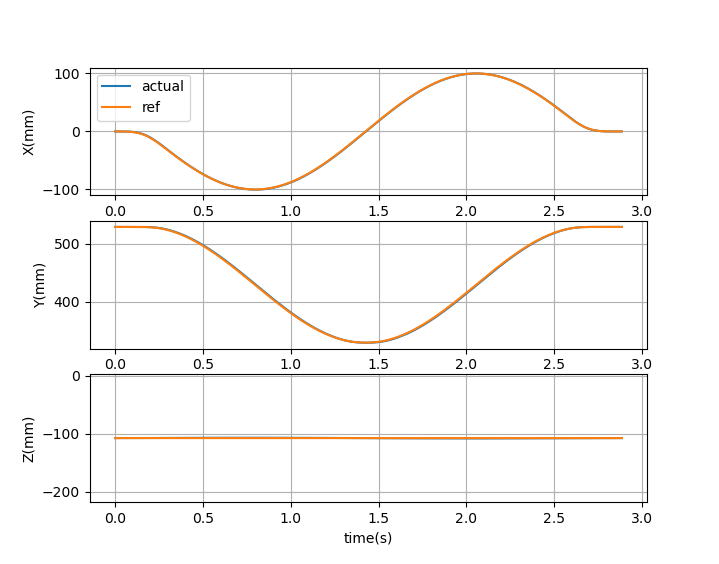
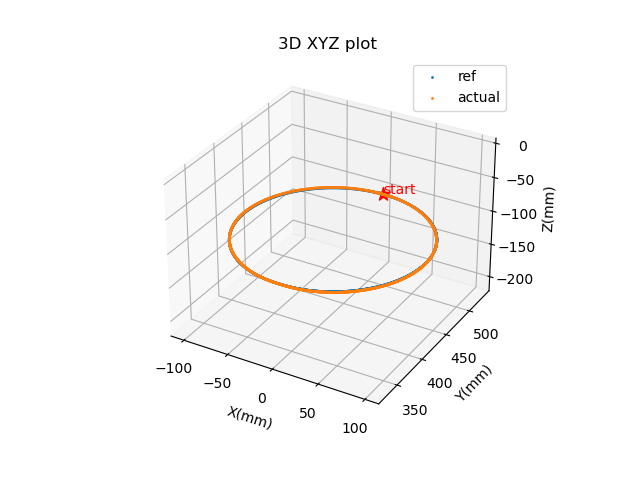
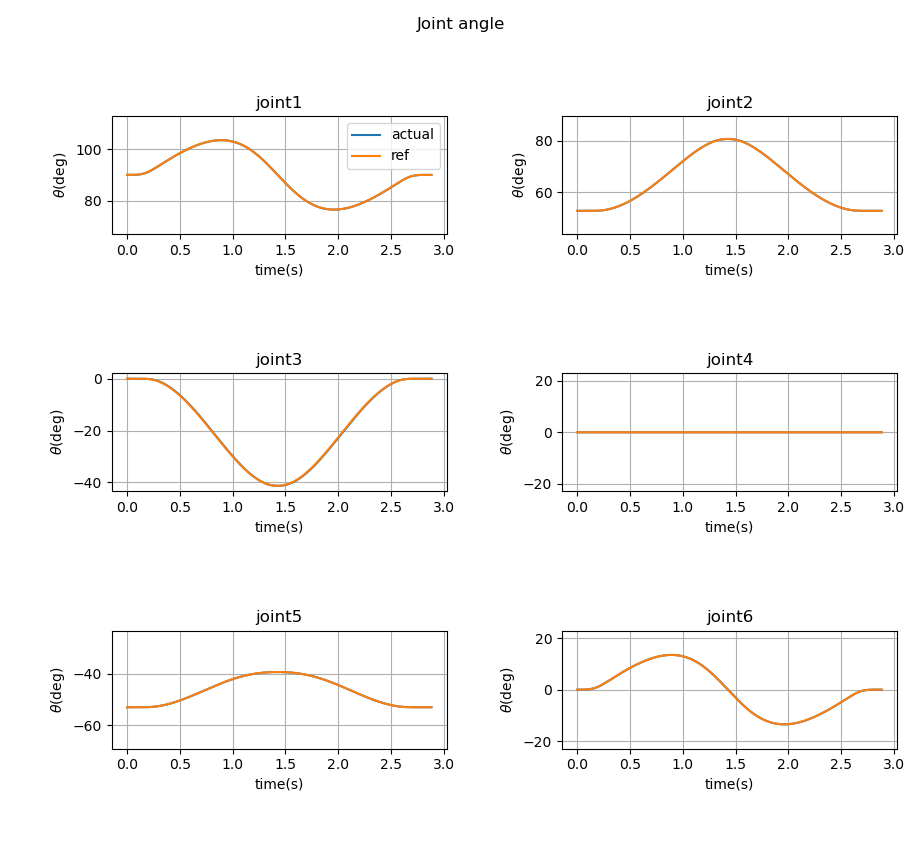
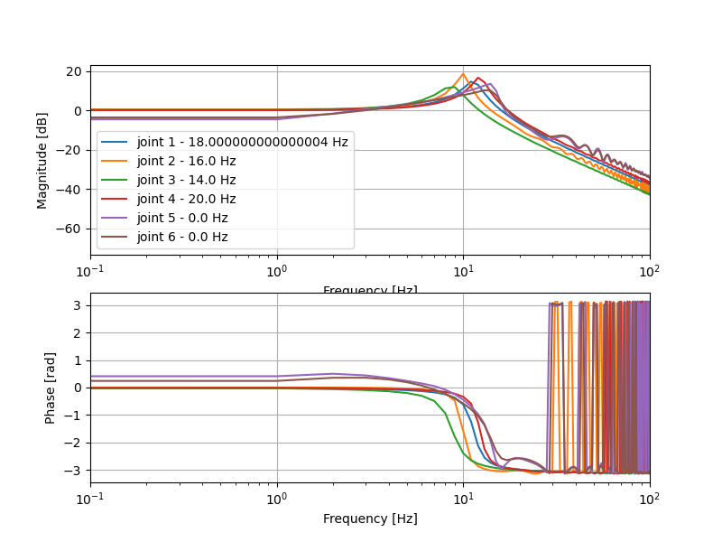
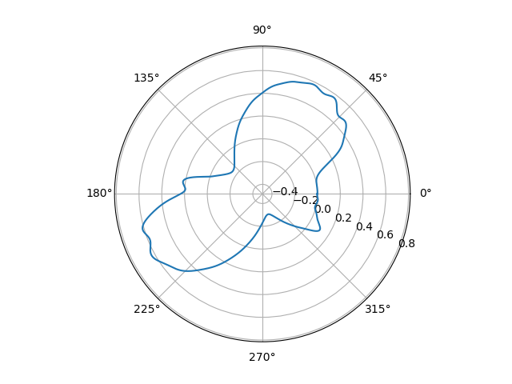

example 3: tunning gain (using joint1 Kpp gain as example)  

```bash
python main.py -pf -pc -pj --Kpp1 100
```

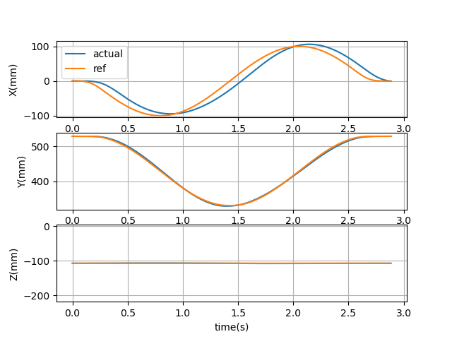
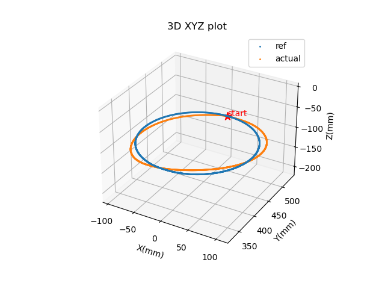
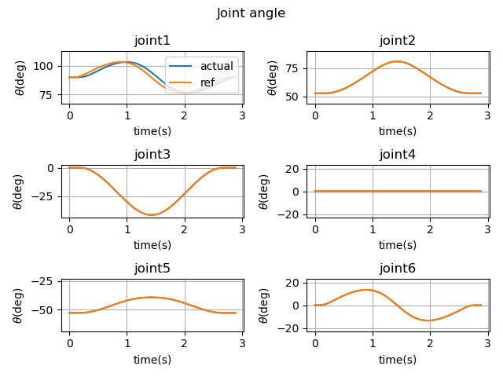
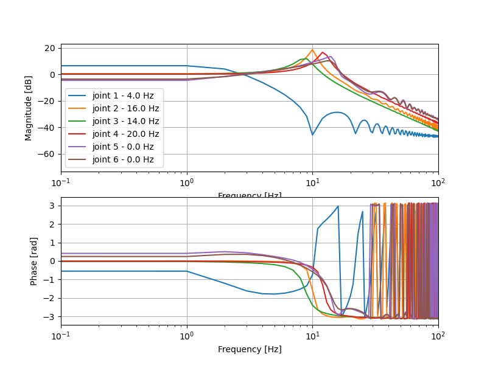

## TODO
***

- [ ] fix the frequency response plot
- [ ] think more experiment
